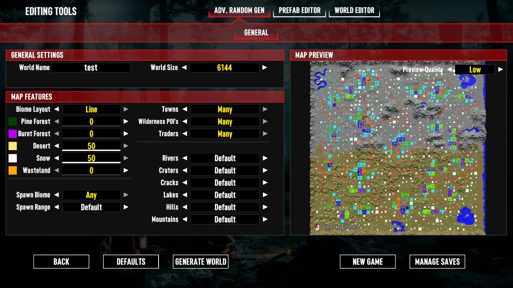

# RWG Patch

A mod for 7 Days to Die.

This mod tweaks the Random World Generation (RWG) system, changing its default behavior to give you better control over your world creation.

### Key Features:

- **Randomized Trader Spawns:** Disables biome restrictions for traders. All traders can now spawn randomly in any biome.
- **Fully Customizable Biome Ratios:** Allows you to set biome ratios to 0%. You can now create worlds with only 1 or 2 specific biomes.
- **World Name as Seed:** Replaces the Seed input box with a World Name input box. You can now name your world whatever you like, and the entered World Name will be used as the generation seed string.
- **Persistent RWG Settings:** Your custom world generation settings are automatically saved. When you open the advanced RWG screen next time, your previous settings will be restored as the default values. These saved settings are also applied when using the "Simple Generation" option on the New Game screen.
- **Visual Fix (Preview Screen):** Fixes a vanilla bug where the lighting/shadow direction on the terrain preview was inverted, making mountains look like hollow valleys.

## Generator Options

This mod adds the following new configuration settings:

### Traders

Adjusts the total number of traders that will spawn in the world.

- **None:** No traders will spawn at all.
- **Few:** Reduces the number of traders below the vanilla default for large worlds (6k+). For smaller worlds, the change is minimal.
- **Default:** Spawns a sufficient number of traders (though it may be slightly fewer than vanilla).
- **Many:** Spawns a high number of traders (equivalent to vanilla).

### Spawn Range

Determines how many meters away from the first trader (or city/town) the player's spawn points will be placed.

- **Short:** Spawns players within 600 meters of a trader. If no traders exist, spawns within 600 meters of a city or town (similar to Alpha 21).
- **Default:** Spawns players within 900 meters of a trader. If no traders exist, spawns within 900 meters of a city or town (equivalent to vanilla).
- **Long:** Spawns players within 1200 meters of a trader. If no traders exist, spawns within 1200 meters of a city or town.

### Spawn Biome

Determines which biome the player can spawn in at the start of the game.

- **Default:** Spawns players in the Forest biome whenever possible (equivalent to vanilla).
- **Any:** Spawns players randomly in any available biome.
