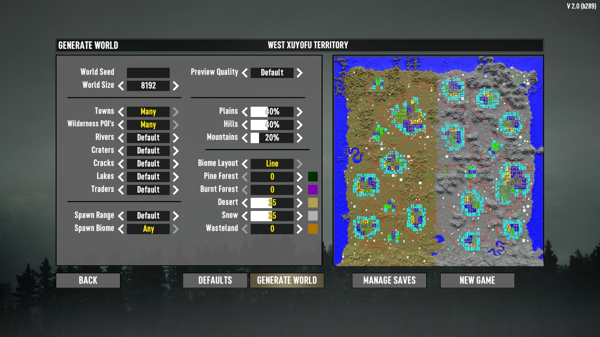

# RWGPatch

A mod for 7 Days to Die V1.0.

This mod patches RWG to fix various issues.

- No more trader will sticks to biome.
- Single-biome world can be generated.
- The world generation settings will be permanent. It is also used in the simple generation on the New Game.
- The world map preview can be zoomed in/out with mouse scrolling, and can be moved by mouse dragging.
- Fix a problem in which the unevenness of the world map preview appears to be reversed.

## Generator Options

This mod changes following options.

- Biome Layout  
  Change "Line" in the last option to "Single". The world will be generated with biome that the highest weighted of them.

This mod adds following options.

- Traders  
  Amount of trader spawns.

  - None  
    No any traders will be spawned.
  - Few  
    For large worlds (6k+) it will be less than the default, but for small worlds there will not be much change.
  - Default  
    Enough traders will be spawned. (But maybe less than vanilla.)
  - Many  
    Many traders will be spawned. (Almost the same as vanilla.)

- Spawn Range  
  How many meters away from first trader (or city) should spawn points be placed?

  - Short
    Spawn points are placed within 600 meters from a trader if a trader is spawned in the world, otherwise within 600 meters from a city or town. (Simillar to A21)
  - Default  
    Spawn points are placed within 900 meters from a trader if a trader is spawned in the world, otherwise within 900 meters from a city or town. (Almost the same as vanilla.)
  - Long  
    Spawn points are placed within 1.2K meters from a trader if a trader is spawned in the world, otherwise within 1.2K meters from a city or town.

- Spawn Biome  
  Which biome should spawn points be placed in?

  - Default  
    Spawn points are placed in forest biomes whenever possible. (Almost the same as vanilla.)
  - Randomize  
    Spawn points are randomly placed in any biome.

